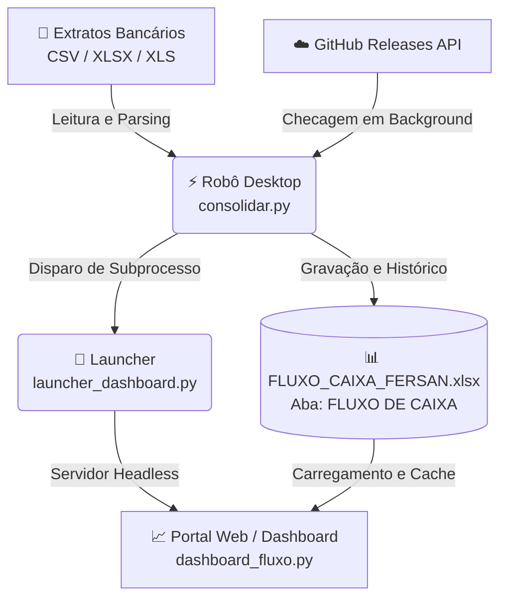

# ⚡ Fersan_Management — Plataforma de Gestão & Automação Financeira

> **Financial Intelligence. Simplified.**  
> Plataforma híbrida (Desktop + Web) desenvolvida para automação contábil, consolidação de extratos bancários, controle de fluxo de caixa e inteligência analítica em tempo real.

---

## 📌 Sumário
1. [Visão Geral da Solução](#-visão-geral-da-solução)
2. [Arquitetura do Sistema](#-arquitetura-do-sistema)
3. [Aplicação Desktop (Robô Financeiro)](#-aplicação-desktop-robô-financeiro)
4. [Portal Web (Dashboard Financeiro)](#-portal-web-dashboard-financeiro)
5. [Contrato de Dados e Estrutura de Planilha](#-contrato-de-dados-e-estrutura-de-planilha)
6. [Mecanismo de Versionamento e Auto-Update](#-mecanismo-de-versionamento-e-auto-update)
7. [Instalação, Execução e Compilação](#-instalação-execução-e-compilação)

---

## 🌐 Visão Geral da Solução

O **Fersan_Management** foi concebido para resolver o trabalho manual e repetitivo de conciliação e consolidação financeira de múltiplas contas bancárias, unificando duas frentes operacionais em uma experiência contínua:

* **Motor Desktop de Alta Performance:** Um aplicativo executável leve construído em Python/Tkinter que monitora extratos bancários (`.xlsx`, `.xls`, `.csv`), limpa os dados brutos, padroniza as informações e consolida o histórico em uma planilha centralizada.
* **Portal Analítico SaaS / Dashboard Web:** Um ambiente web moderno desenvolvido em Streamlit e Plotly, com identidade visual corporativa (Fintech SaaS), permitindo aos gestores visualizar métricas de fluxo de caixa, evolução de saldo acumulado, distribuição por instituição e relatórios detalhados com exportação.



---

## 🏗️ Arquitetura do Sistema

A solução está organizada em módulos desacoplados para garantir estabilidade, segurança e facilidade de manutenção:

```text
Fersan_Management/
├── consolidar.py              # Aplicação Desktop Tkinter, motor de ETL e AutoUpdater
├── launcher_dashboard.py      # Entrypoint e orquestrador do servidor Streamlit
├── requirements.txt           # Dependências oficiais do ecossistema Python
├── FLUXO_CAIXA_FERSAN.xlsx    # Planilha central de banco de dados consolidado
├── dashboard/
│   └── dashboard_fluxo.py     # Interface web corporativa (Streamlit + CSS + Plotly)
├── extratos_bancarios/        # Pasta monitorada para entrada de arquivos brutos
└── docs/                      # Especificações de design, UI/UX e auditorias
```

---

## 🖥️ Aplicação Desktop (Robô Financeiro)

A aplicação desktop (`consolidar.py`) é o ponto de partida do usuário operacional. Ela possui uma interface gráfica construída com foco em praticidade e feedback em tempo real.

### Componentes da Interface Desktop:
1. **Header Institucional:**
   - Logotipo estilizado da marca **Fersan_Management**.
   - Slogan e versão atual do sistema (`v1.3.5`).
2. **Barra de Pilares:**
   - ⚙️ **Automação:** Processamento rápido de múltiplos formatos de extratos.
   - 🏦 **Consolidação:** Centralização de entradas e saídas mantendo histórico.
   - 📊 **Inteligência:** Integração direta com o dashboard analítico.
3. **Card Dinâmico de Monitoramento de Pasta:**
   - Monitora em tempo real a pasta `extratos_bancarios/`.
   - Exibe contador dinâmico de arquivos aguardando processamento (`• X arquivos prontos` em verde).
   - Botão **"Abrir ↗"** que abre a pasta local diretamente no Windows Explorer.
4. **Painel de Ações Principais:**
   - **Iniciar Consolidação:** Lê todos os extratos pendentes, valida colunas, deduplica e grava o resultado no Excel.
   - **Abrir Dashboard:** Inicia o servidor local do dashboard analítico e abre automaticamente o navegador padrão na porta `8501`.
5. **Console de Atividades Dark:**
   - Terminal integrado com visual escuro corporativo.
   - Colorização semântica de eventos:
     - `info` (Azul claro): Logs operacionais e etapas de leitura.
     - `success` (Verde): Confirmação de consolidação e inicialização.
     - `warning` (Amarelo): Alertas de estrutura ou layouts legados.
     - `error` (Vermelho): Falhas de arquivo ou leitura.
     - `accent` (Ciano): Links e status de portas.
6. **Barra de Progresso:** Feedback visual durante o download de atualizações ou processamento massivo de dados.

---

## 📊 Portal Web (Dashboard Financeiro)

O dashboard web (`dashboard/dashboard_fluxo.py`) adota o conceito de **Dark Navy Shell + Superfícies em Branco Neutro**, garantindo contraste e conforto visual para equipes financeiras.

### 1. Barra Lateral (Sidebar Dark Navy Shell)
* **Branding:** Logo em gradiente tecnológico e identidade visual.
* **Navegação Modular:**
  - `Dashboard`: Visão executiva com KPIs e gráficos analíticos.
  - `Lançamentos`: Tabela detalhada de transações com busca e exportação.
  - `Módulos de Expansão`: Contas Bancárias, Extratos, Conciliação, Fluxo de Caixa, Contas a Pagar/Receber, Relatórios e Configurações.
* **Filtros Globais:** Seletores de **Ano de Referência** e **Mês de Referência** dinamicamente alimentados pela base histórica.
* **Botão Sincronizar Dados:** Limpa o cache interno (`st.cache_data.clear()`) e recarrega os dados da planilha instantaneamente.
* **Status de Conexão:** Badge indicando conexão ativa com o arquivo `FLUXO_CAIXA_FERSAN.xlsx`.

---

### 2. Tela Principal: Dashboard Geral

#### A. Header Executivo
* Título com identificação do período selecionado (ex: `Dezembro/2025`).
* Quantidade total de lançamentos consolidados.
* Timestamp de última atualização (ex: `Atualizado às 14:32`).
* Badge indicando a fonte de dados oficial.

#### B. Grid de KPIs Estruturado (Superfície Branca + Semântica)
* **Saldo do Período (Hero Card):** Destaque visual com borda de acento semântica (Verde se positivo, Vermelho se negativo), valor em 26px bold e tag de status (`Positivo` ou `Déficit`).
* **Total de Receitas:** Volume consolidado de créditos registrados no mês em verde financeiro (`#16A34A`).
* **Total de Despesas:** Volume consolidado de débitos operacionais no mês em vermelho financeiro (`#DC2626`).
* **Volume de Transações:** Quantidade total de operações e cálculo automático do **Ticket Médio** por transação.

#### C. Gráficos Analíticos de Alto Desempenho (Plotly)
* **Fluxo de Caixa Diário:**
  - Gráfico de barras agrupadas comparando Receitas (verde) e Despesas (vermelho) dia a dia.
  - Margem esquerda calibrada (`l=85`) para eliminar qualquer corte nos valores do eixo Y (`R$ 30.000,00`).
  - Tooltips detalhados formatados no padrão brasileiro de moeda.
  - Barra de ferramentas de debug do Plotly totalmente ocultada (`displayModeBar: False`).
* **Evolução do Saldo Acumulado:**
  - Gráfico de linha contínua em azul tecnológico (`#2563EB`) com preenchimento sutil de área (`rgba(37, 99, 235, 0.08)`).
  - **Agregação Diária Inteligente:** Agrupa múltiplas transações do mesmo dia antes de calcular o acumulado, eliminando ruídos e serrilhados no gráfico.
  - **Zero Line Visível:** Linha de referência `R$ 0` destacada para identificação instantânea de momentos de superávit ou déficit.
* **Distribuição por Instituição (Regra Dinâmica):**
  - Se o período tiver movimentação em apenas **1 banco**: Exibe card de resumo executivo destacando `100% da movimentação`.
  - Se houver **2 ou mais bancos**: Exibe um gráfico Donut elegante utilizando uma escala cromática de azuis corporativos (`#0B2447`, `#2563EB`, `#0EA5E9`, `#38BDF8`).

#### D. Resumo Consolidado por Instituição
* Renderizado dentro de um card branco fechado de alta legibilidade.
* Exibe cada instituição com:
  - Nome do Banco em `#172033` (bold).
  - Saldo consolidado formatado em BRL (`#2563EB`).
  - Percentual de participação sobre o volume total do período (`#64748B`).
  - Barra de progresso horizontal em gradiente tecnológico azul.

---

### 3. Tela de Lançamentos (Transações Detalhadas)
* **Tabela em Tela Cheia (`height=750`):** Visualização completa das colunas da planilha (`DATA`, `TIPO`, `DESCRIÇÃO`, `VALOR`, `BANCO`, `STATUS`, `REFERENCIA`, `OBSERVAÇÃO`).
* **Filtros e Busca Rápida:**
  - Campo de pesquisa em tempo real por descrição ou código de referência.
  - Dropdown para filtrar apenas `ENTRADA`, apenas `SAIDA` ou `Todos`.
* **Cores Semânticas na Coluna "Tipo":**
  - `ENTRADA` em verde financeiro (`#16A34A`, bold).
  - `SAIDA` em vermelho financeiro (`#DC2626`, bold).
* **Formatação pt-BR:** Datas em `DD/MM/AAAA` e valores em `R$ 0.000,00`.
* **Exportação CSV:** Botão para download direto das transações filtradas em arquivo `.csv` formatado com separador `;` para abertura direta no Microsoft Excel.

---

## 🗄️ Contrato de Dados e Estrutura de Planilha

A planilha `FLUXO_CAIXA_FERSAN.xlsx` utiliza a aba `FLUXO DE CAIXA` estruturada no layout bilateral de 8 colunas:

| Bloco | Colunas (Índice) | Nomes das Colunas |
|---|---|---|
| **ENTRADAS (Receitas)** | 0 a 7 (Colunas A até H) | `DATA`, `TIPO`, `DESCRIÇÃO`, `VALOR `, `BANCO`, `STATUS`, `REFERENCIA`, `OBSERVAÇÃO` |
| **Separador** | 8 (Coluna I) | *(Coluna vazia de respiro)* |
| **SAÍDAS (Despesas)** | 9 a 16 (Colunas J até Q) | `DATA`, `TIPO`, `DESCRIÇÃO`, `VALOR `, `BANCO`, `STATUS`, `REFERENCIA`, `OBSERVAÇÃO` |

> 💡 **Retrocompatibilidade:** O sistema possui rotinas de fallback para ler layouts antigos de 7 colunas sem interromper o fluxo de dados.

---

## 🔄 Mecanismo de Versionamento e Auto-Update

O sistema possui um pipeline de atualização automática integrado ao GitHub Releases:

1. **Checagem em Background:** Ao iniciar a aplicação desktop, uma thread paralela consulta a API pública:
   `https://api.github.com/repos/Rafaelgarra/Fersan_Management/releases/latest`
2. **Comparação Semântica:** A versão remota é comparada com a `VERSAO_ATUAL` utilizando a biblioteca `packaging.version`.
3. **Download com Barra de Progresso:** Se houver versão mais recente (`v1.3.5 > v1.3.4`), o usuário é notificado por um diálogo. Se aceito, o binário (`.exe` ou `.zip`) é baixado com exibição da porcentagem na tela.
4. **Substituição e Reinicialização Transparente (`updater.bat`):**
   - O aplicativo cria um script em lote temporário.
   - Encerra o processo do executável atual.
   - Substitui o binário antigo pelo novo (ou extrai os arquivos do `.zip`).
   - Reinicia a nova versão e remove o script temporário.

---

## 🚀 Instalação, Execução e Compilação

### 1. Pré-requisitos
* Python 3.10 ou superior instalado.
* Git instalado.

### 2. Instalação das Dependências
```bash
git clone https://github.com/Rafaelgarra/Fersan_Management.git
cd Fersan_Management
pip install -r requirements.txt
```

### 3. Execução em Ambiente de Desenvolvimento
* **Executar o Robô Desktop:**
  ```bash
  python consolidar.py
  ```
* **Executar diretamente o Dashboard Web:**
  ```bash
  streamlit run dashboard/dashboard_fluxo.py
  ```

### 4. Compilação para Produção (PyInstaller)

Para gerar os executáveis independentes para distribuição aos clientes:

1. **Compilar o Dashboard (`launcher_dashboard.exe`):**
   ```bash
   pyinstaller --noconfirm --onedir --windowed --add-data "dashboard;dashboard" --copy-metadata streamlit launcher_dashboard.py
   ```
2. **Compilar o Robô Principal (`RoboFersan.exe`):**
   ```bash
   pyinstaller --noconfirm --onefile --windowed --name "RoboFersan" consolidar.py
   ```

---

## 🛡️ Licença e Governança
Desenvolvido para uso corporativo exclusivo do grupo empresarial **Fersan_Management**. Todos os direitos reservados.
